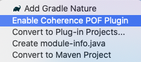

<!--

  Copyright (c) 2021 Oracle and/or its affiliates.

  Licensed under the Universal Permissive License v 1.0 as shown at
  https://oss.oracle.com/licenses/upl.

-->


# Coherence Eclipse Plugin
   

[](https://oss.oracle.com/licenses/upl/)

# Contents

* [Overview](#overview)
* [Install the Plugin](#install-the-plugin)
* [Using the Plugin](#using-the-plugin)
* [Example Projects](examples/pof-plugin-example-project)
* [Development](#development)
  * [Build the Plugin](#build-the-plugin)
  * [Install the Plugin Manually](#install-the-plugin-manually)
  * [Open The Plugin Project](#open-the-plugin-project)


# Overview

> For full documentation on the Coherence POF code generator and using PortableType annotations
> see the official [Portable Types documentation](https://coherence.community/20.12/docs/#/docs/core/04_portable_types)

The Coherence Eclipse Plugin provides various features to help developer productivity when working with Coherence.
For full documentation on the Coherence POF code generator and using PortableType annotations see the official Portable Types documentation
Currently this plugin supports the following features:
* `Coherence POF Plugin` - Provides a development time instrumentation of classes with the PortableType annotation to generate
  consistent (and correct) implementations of Evolvable POF serialization methods.
  This development time plugin can be used in conjunction with the [POF Maven Plugin](https://github.com/oracle/coherence/tree/master/prj/plugins/maven/pof-maven-plugin) which instruments classes at project build time.
  See the official [Portable Type](https://coherence.community/20.12/docs/#/docs/core/04_portable_types) documentation for more details on writing portable types in Coherence. 

# Install the Plugin

To install the plugin carry out the following:

1. Choose <kbd>Help</kbd> -> <kbd>Install New Software</kbd>

1. Click on <kbd>Add</kbd> button on the right

1. Choose a name such as `Coherence Eclipse Plugin Update Site`

1. Enter the location of the Plugin Repository `https://oracle.github.io/coherence-eclipse-plugin/eclipse/1.0.0` and click <kbd>Add</kbd>.

1. Select the `Coherence Eclipse Plugin` displayed in the list and click <kbd>Next</kbd>, then <kbd>Next</kbd>

1. Accept the license terms and click <kbd>Finish</kbd>

1. Click <kbd>Restart Now</kbd> to restart Eclipse

If you are using Eclipse Marketplace Client, then drag the following to your running Eclipse workspace:

[](http://marketplace.eclipse.org/marketplace-client-intro?mpc_install=5351771 "Drag to your running Eclipse* workspace. *Requires Eclipse Marketplace Client")


# Using the plugin

> Note: You can use the example project [here](examples/pof-plugin-example-project) to test the plugin.

## Enable the Plugin

1. Right-click on your open project

2. Select <kbd>Configure</kbd> then <kbd>Enable Coherence POF Plugin</kbd>



## Disable the Plugin

1. Right-click on your open project

2. Select <kbd>Configure</kbd> then <kbd>Disable Coherence POF Plugin</kbd>

## Verifying

When you build your project, for any Java classes that use the `@PortableType` annotation
you will see an Info message in the `Problems` tab saying the class was instrumented.

A message indicating the class was not instrumented can indicate that it has already been instrumented
or is ignored because is does not implement the `PortableType` annotation.


   
# Uninstall the Plugin

1. Choose <kbd>Help</kbd> -> <kbd>Install New Software</kbd>

1. Click on <kbd>What is already installed</kbd> link

1. Search for <kbd>Coherence</kbd> and select <kbd>Coherence Eclipse Plugin</kbd>

1. Click <kbd>Un-install</kbd> then <kbd>Finish</kbd>

1. Click <kbd>Restart Now</kbd> to restart Eclipse  

# Development

## Build the Plugin

You must have:
* JDK1.8
* Maven 3.6.3+
* Minimum Eclipse version 2020-03

1. Clone the repository

   ```bash
   git clone https://github.com/oracle/coherence-eclipse-plugin.git
   ```

1. Build the plugin

   ```bash
   cd coherence-eclipse-plugin
   
   mvn clean install
   ```

This will generate a zip file called `./coherence.eclipse.plugin.repository/target/coherence-eclipse-plugin-repository-1.0.0-SNAPSHOT.zip`

## Install the Plugin manually

1. Choose <kbd>Help</kbd> -> <kbd>Install New Software</kbd>

1. Click on <kbd>Add</kbd> button on the right

1. Choose a name such as <kbd>Coherence Local</kbd>

1. Click on <kbd>Archive</kbd> and choose the zip file mentioned above and click <kbd>Add</kbd>

1. Select the <kbd>Coherence Eclipse Plugin</kbd> displayed in the list and click <kbd>Next</kbd>, then <kbd>Next</kbd>

1. Accept the license terms and click <kbd>Finish</kbd>

1. You may receive a warning that the plugin is unsigned. Choose <kbd>Install Anyway</kbd>

1. Click <kbd>Restart Now</kbd> to restart Eclipse  

## Open the Plugin Project

To import the plugin project into your Eclipse IDE, carry out the following:

1. Clone the repository using:

   ```bash
   git clone https://github.com/oracle/coherence-eclipse-plugin.git
   ```

1. Open Eclipse

1. Choose <kbd>File</kbd> -> <kbd>Open Projects from Filesystem</kbd>

1. Choose <kbd>Directory</kbd> and select the <kbd>coherence-eclipse-plugin</kbd> project you cloned, then click `Done`

1. Ensure you only select the `coherence-ecplise-plugin/coherence.eclipse.plugin` as shown below:

   

> Note: Ignore any errors from the `pom.xml` file as this is only used for a Maven build.
